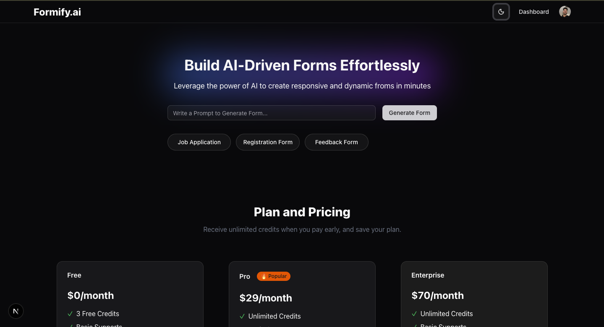

# AI_FORM_GENERATOR

Build your own **AI-Powered Form Generator SaaS** from scratch! 🚀  

Uses **Next.js 15, Prisma, Clerk, OpenAI, TypeScript, and Docker** to create a **scalable, production-ready app**. Generate dynamic forms with AI, manage users securely, and deploy effortlessly.  

---

## Tech Stack


---

## Screenshot



---

## Features

- Generate dynamic forms powered by AI  
- User authentication & secure data storage  
- Easily deployable with Docker  
- Scalable architecture for production use  

---

## Getting Started

1. Clone the repo:  
```bash
git clone https://github.com/singhayush007/AI_FORM_GENERATOR.git
